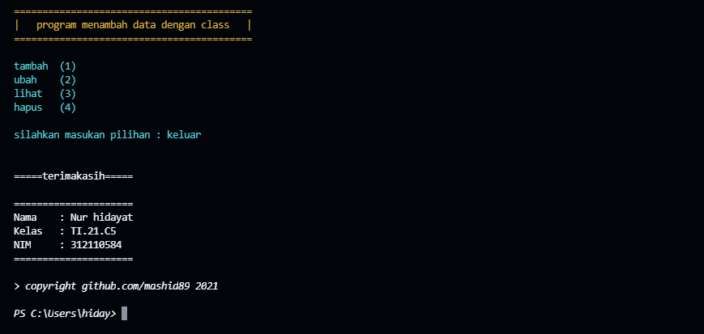

```javascript
> NAMA    = NUR HIDAYAT
> NIM     = 312110584
> KELAS   = TI 21 C5
```

# PERTEMUAN 12
pada pertemuan 12 saya diberi soal :


## DIAGRAM CLASS


## FLOWCHART


## PROGRAM

pertama saya membuat sebuah class daftar nilai
```py
class daftarNilai()
```
Lalu saya melanjutkan dengan membuat method method fungsinya
```py
def tambah(self)
def ubah(self)
def lihat(self)
def hapus(self)
```
lalu saya mengisi setiap method dengan elemen elemen nya
```py
nama       = str(input("masukan nama: "))
nim        = str(input("masukan nim :"))                                         
nilaiTugas = int(input("Masukkan Nilai Tugas: "))
nilaiUts   = int(input("Masukkan Nilai UTS\t: "))            
nilaiUas   = int(input("Masukkan Nilai UAS\t: "))             
nilaiAkhir = (0.30 * nilaiTugas) + (0.35 * nilaiUts) + (0.35 * nilaiUas)
dt[nama]   = nim,nilaiTugas,nilaiUts,nilaiUas,nilaiAkhir
```
lalu saya membuat sebuah looping
```py
while True:
    input('tambah   (1)
           ubah     (2)
           lihat    (3)
           hapus    (4)
           ')
    c = input("\nsilahkan masukan pilihan : ")
```
dan terakhir membuat fungsi if else untuk menjalankan method
```py
if (c=="1"):
    data.tambah()
elif (c=="2"):
    data.ubah()
elif (c=="3"):
    data.lihat()
elif (c=="4"):
    data.hapus()
else:
    data.keluar()
    break
```
## TAMPILAN VISUAL STUDIO CODE


## OUTPUR
> menambah data


> melihat data


> menambah lagi

 

> melihat hasil


> mengubah data


> hasil


> menghapus apabila memilih t


> menghapus apabila memilih y


> keluar




======TERIMAKASIH======
